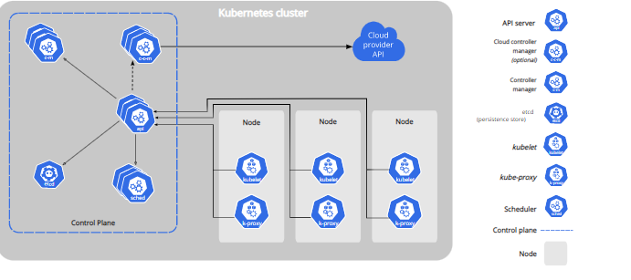

### High avilability(HA)
when we run our application on docker container and if the container fails , we need to manually start the container
if the node i.e machine fails all the container running onthe machine should be re-created on the other machine
k8s can do both of the above

Auto scaling 
  * containers don't scale on their own
  * scaling is of two types
      *  vertical scaling
      *  horizantal scaling
  *  k8s cando both vertical and horiznatal scaling of containers
* zero down time deployements
    * k8s can handle deployements with near zero-down time deployements
    * k8s can handle rollout(new version) and roll back (undo previous version=> previous version)
* k8s described as ` production grade container management `

* History
   * Google had a history of running everything on containers
   * To manage these containers , google has deployed container managed tools(in house)
         * Borg
         * Omega
   * With docker publicizing containers, with the experiencing in running and managing containers, google has started a project kubernates(developed in go) and then handed it over to cloud native container foundation (CNCF)

* Competetiors
    * Apache mesos
    * hashocorp nomad
    * docker swam 
    * but k8s is clear winner
* Terms
* Distributed system
* Node
* Cluster
* State
* statefull aplications
* stateless applications
* monolith 
* micro services
* desired state
* Declarative vs imperative
* pet vs cattle
preview k8s.png


* ### K8s cluster architecture
* cluster architectuure
* cluster has nodes, communication between nodes and the control plane, controllers, leases, cloud controller manager, about cggroup, container runtime interface, garbage collection these are thecomponents of cluser

* ### nodes
* k8s loads your workload by placing containers into pods to run on nodes. a node may be virtual or physical machine. depending on the cluster. each node is managed by the control plane and containes services neccessary to run pods
* typically we have several inthe cluster in a lerning or resource limited envirtonment you might have only one node
* the components of node include `kubelet` a `container runtime` and the `kube-proxy`

* ### management 
* there are two mains ways to have nodes added to the `API-SERVER`
* 1. the kubelet on a node self-registries to the control plane 
* 2. you(or another human user) manually a node object
* after you create node object or a kubelet on a node self registrirs the control plane checks whether the new node object is valid. for example if you try to create a node from the following yaml manifest:
```yaml
---
apiversion: v1
kind: node
metadata:
  name: '10.240.79.157'
  labels:
    name: 'my-first-k8s-node'
```
* k8s creates node object internally (the presentation). kubenates checks that a kubelet has registed to the api server that matches to the maetadata.name field of the node if the node is healthy all neccesssary services are running then it is eligible to run a pod otherwise the node is ignored for any cluster activity until it becomes healthy
* k8s keeps the object for the invalid node and continuous checking to see wheather it becomes healthy
* you, or a controller must explictly delete the node object to stop the health checking
* The name of a node object must be a valid `DNS subdomain name`.
* Node name uniqeness 
* The `name` identifies a node. two nodes can't have the same name at the same time

* ### communication nodes and control plane 
* `node to control plane`
* Kubernates has a "hub-and-spoke" api pattern. all api usage from nodes (or the pods they run)
* `control plane to node`
* api-server to kubelet
* The connection from the api server to the kubelet are used for 
* `fetching logs for pods 
* attaching (usually through kubectl) to run the pods
* providing the kubelet's port-forwarding functionality
* ### Controllers
* In robotics and automation, a control loop is a non-terminating loop that regulates the state of system
* Here is the one of example
  * when you ste the temparature that tells the thermostat about your desired state 
  * the actual room temparature is the current state. the thermostat acts to bring the current state to to closer to the desired state, by turning equipment on or off
  * In k8s controllers are control loops that watch the state of your cluster then make or request changes where needed each controller  tries to move the current cluster closer to desired state
* ### Controller pattern
* A controller tracks at least one k8s resource type. These `object` have a spec field that represents the desired state.
* ### controller via Api server
* the job controller is an example of k8s built-in controller , built-in controllers manage state by interacting with the cluster api server.

* ### Leases
* Distributed systems often have a need for leases which provide mechanism to lock  shared resoureces coordinate activity between  members of a set 
* ### cloud controller manager 
* cloud infrastructure technologies let you run k8s on public or private and hybrid clouds k8s belive in automated, api-driven infrastructure without tight coupling between components

### About cgroup
* On linux, control groups constrain resources that are allocated to processes
* the kubelet and the underlaying container runtime need to inteerface with cgroups enforce resource management for pods and containers which includes cpu/memory requests AND limits for containerized workloads
* ### container runtime interface (CRI)
* The CRI Is a plugin interface which enables the kubelet to use a wide variety 
* ### Garbage collection 
* Terminated pods 
* completed jobs
* Objects without owner reference 
* Unused containers and container images
* Dynamically provisioned persistent volumes with storage class reclaim policy of delete
* stale or expired certificatesingingrequests(csrs)


      
